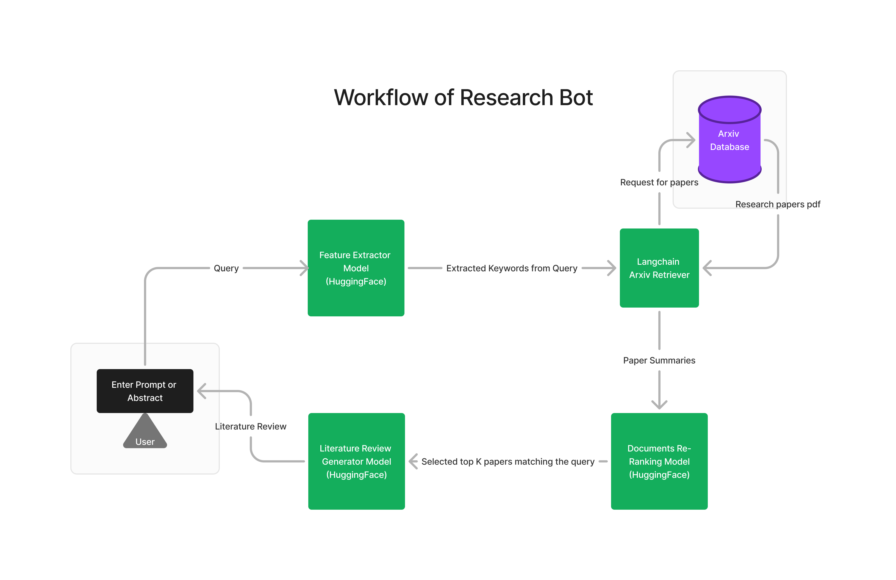

# Brain-Tumor-Detection-CNN

This GenAI project is powered by multiple LLMs and is helpful for researchers who want to research about some topics but dont know from where to start. If you have any research idea or if you have a project abstract ready you can input that in this program and it will perform literature survey for you and will provide you with Literature Review containing overview about all recent works in that domain with proper references.
## Workflow

  


## Run Locally

Clone the project

```bash
  git clone https://github.com/singhvaibhav924/Research-Bot-Notebook.git
```

Go to the project directory

```bash
  cd Research-Bot-Notebook
```

Setup Virtual Environment

```bash
  pip install virtualenv
  virtualenv venv
  venv/Scripts/Activate.ps1
```

Install dependencies

```bash
  pip install numpy torch langchain-huggingface langchain-community arxiv sentence-transformers accelerate
```


